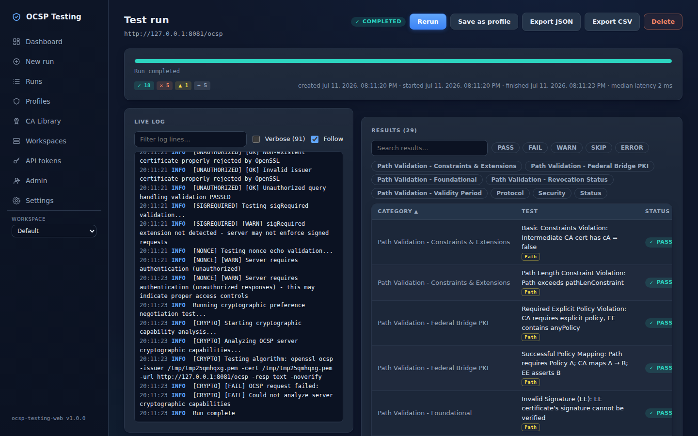
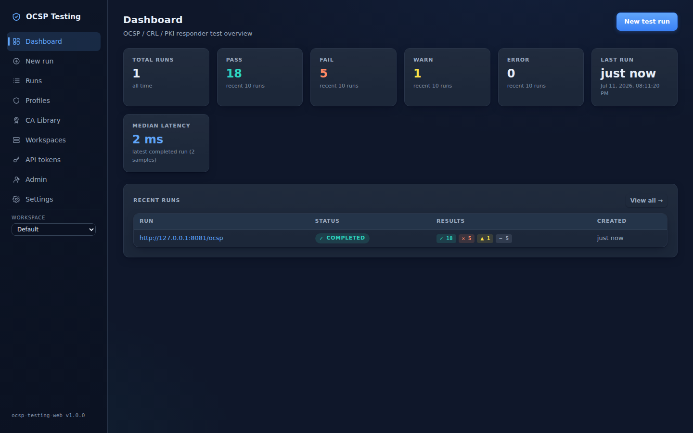
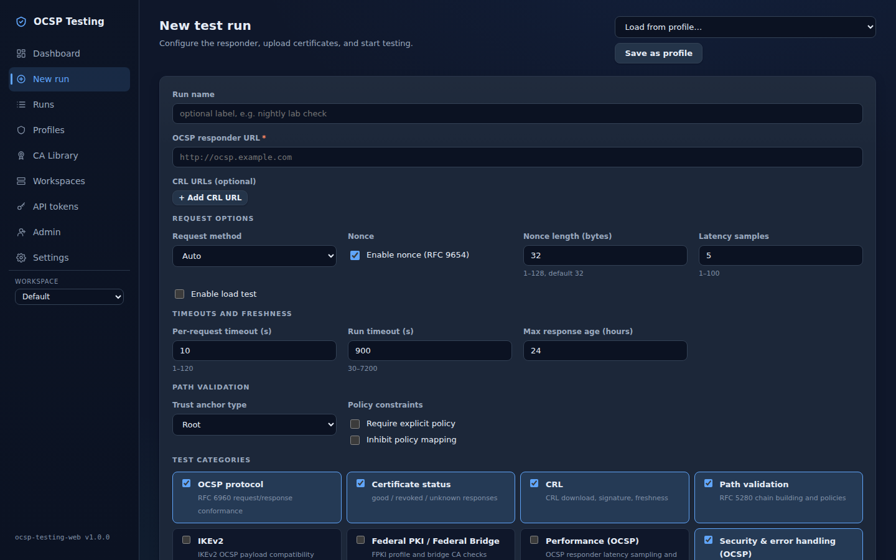
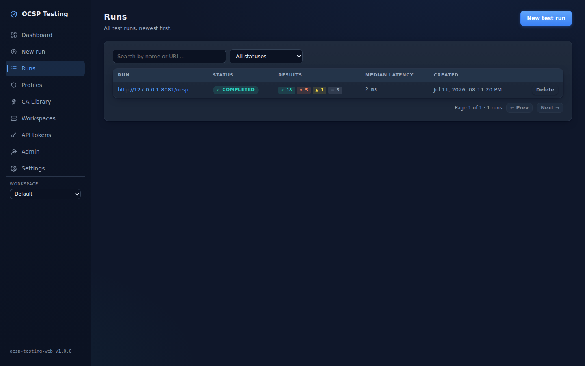
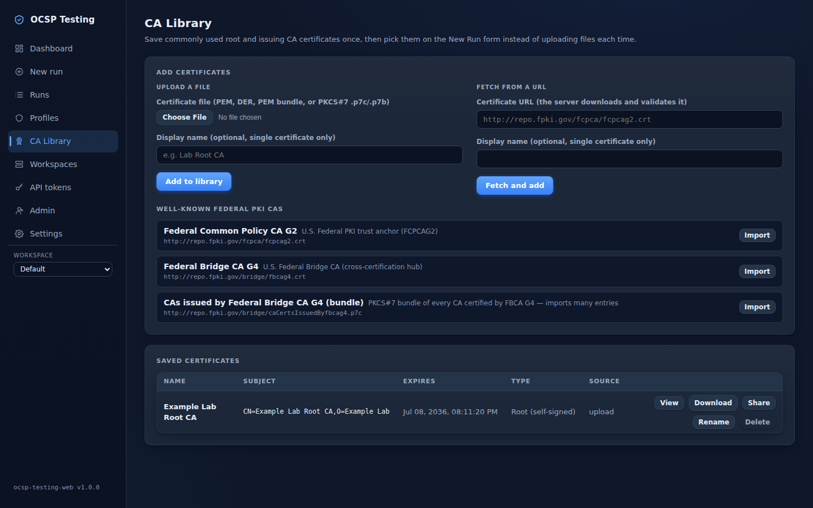

# OCSP / CRL Testing Web

[](https://github.com/jgoodloe/ocspcrltesting/actions/workflows/build.yml)
[](https://github.com/jgoodloe/ocspcrltesting/security/code-scanning)
[](https://github.com/jgoodloe/ocspcrltesting/releases/latest)
[](https://github.com/jgoodloe/ocspcrltesting/pkgs/container/ocspcrltesting)

A self-hostable web application (with a companion CLI) for **testing and
monitoring OCSP responders and CRL endpoints**. Point it at a responder,
give it the certificates to exercise, and it validates the revocation
infrastructure against **RFC 6960** (OCSP), **RFC 5280** (certificate/CRL
profile and path validation), and **U.S. Federal PKI / Federal Bridge**
requirements — then tells you exactly what passed, what failed, and why,
with the RFC references and raw exchanges to prove it.

It grew out of [jgoodloe/OCSPTesting](https://github.com/jgoodloe/OCSPTesting),
repackaged as a multi-user web platform for Docker/nginx deployment.



> ⚠️ **Runs unauthenticated by default.** With no auth configured (the shipped
> compose leaves `OCSPWEB_SESSION_SECRET` and `OCSPWEB_BOOTSTRAP_ADMIN_PASSWORD`
> empty), the app runs open as a single anonymous **global admin** and makes
> outbound requests to user-supplied URLs. Keep it on localhost / an isolated
> lab, or enable authentication and TLS before exposing it — see
> [docs/AUTH.md](docs/AUTH.md) and [docs/SECURITY.md](docs/SECURITY.md).

## What it tests

Each run executes the suites you select, streaming results live — one row per
test with **PASS / FAIL / WARN / SKIP / ERROR**, the relevant RFC citation,
and per-test diagnostics (the actual HTTP exchanges and openssl commands):

| Suite | Coverage |
|---|---|
| **OCSP protocol** | GET/POST transport, DER encoding, response structure, nonce handling (RFC 9654 aware), hash-algorithm support |
| **Certificate status** | good / revoked / unknown / unauthorized responses |
| **CRL** | distribution-point discovery, fetch/parse, signature and freshness checks, CRL-vs-OCSP consistency |
| **Path validation (RFC 5280)** | signature and name chaining, validity, basic constraints, key usage, path length, policy processing — with AIA chain discovery and PKCS#7 bundles |
| **Federal PKI / Federal Bridge** | policy mapping, delegated-responder EKU, agency response handling |
| **Performance** | latency sampling, optional load testing |
| **Security & error handling** | response signature validation; unauthorized/malformed/`sigRequired` handling |
| **IKEv2** | informational OCSP-in-IKEv2 checks (RFC 4806) |

## Quick start

```bash
git clone https://github.com/jgoodloe/ocspcrltesting && cd ocspcrltesting
docker compose up
# open http://localhost:8080/
```

Or run the prebuilt multi-arch image (amd64 + arm64, published with SLSA
provenance, an SPDX SBOM, and a GitHub-signed attestation):

```bash
docker pull ghcr.io/jgoodloe/ocspcrltesting:1.2
gh attestation verify oci://ghcr.io/jgoodloe/ocspcrltesting:1.2 --owner jgoodloe
```

Requirements: Docker (recommended) or Python 3.10+ and Node for a source
build; the test engine shells out to the `openssl` CLI. SQLite works out of
the box; PostgreSQL is recommended for multi-user deployments.

## A tour

**Dashboard** — run history at a glance: pass/fail/warn/error counts and
responder latency for recent runs.



**New run** — pick the responder, upload or reuse certificates from the CA
library, choose suites, and tune the network policy per run.



**Run history** — searchable, filterable by status, exportable as JSON or CSV.



**CA library** — keep issuer/CA certificates on the server (upload, fetch by
URL, or import well-known Federal PKI roots), inspect their v3 extensions,
and reference them in runs instead of re-uploading files.



## Ways to use it

- **Web UI** — interactive runs, live log + result streaming, run history
- **REST API** — automation/CI with per-user, workspace-scoped bearer tokens
  ([docs/API.md](docs/API.md))
- **CLI** (`cli.py`) — the same engine, headless

## Multi-user

Workspaces isolate runs, profiles, and certificates, with **viewer / member /
admin** roles per workspace. Sign in locally or via **OIDC SSO** (e.g.
authentik) with group-to-role mapping. Saved run configurations
(**profiles**) and certificates can be shared across workspaces.

## Safety by default

Because the app fetches user-supplied URLs, it ships with an **SSRF policy**:
loopback, private, link-local, and cloud-metadata targets are blocked, every
redirect hop is re-validated, and response sizes/timeouts are capped. A
per-workspace lab mode relaxes private targets for internal responders.
Details in [docs/SECURITY.md](docs/SECURITY.md).

## Documentation

| Doc | Contents |
|---|---|
| [README_WEB.md](README_WEB.md) | architecture, local development, configuration |
| [docs/API.md](docs/API.md) | REST / WebSocket API reference |
| [docs/AUTH.md](docs/AUTH.md) | authentication, workspaces, OIDC |
| [docs/DEPLOYMENT_NGINX.md](docs/DEPLOYMENT_NGINX.md) | root and `/ocsp/` subpath deployment |
| [docs/DEPLOYMENT_HOMELAB.md](docs/DEPLOYMENT_HOMELAB.md) | homelab deployment guide |
| [docs/SECURITY.md](docs/SECURITY.md) | security model and vulnerability disclosure |
| [CHANGELOG.md](CHANGELOG.md) | release history |

## License

See [LICENSE](LICENSE).
