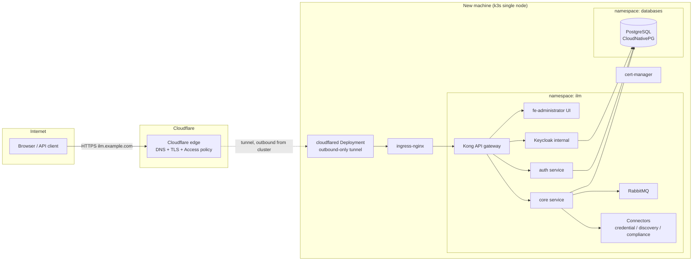

# Deployment Plan: OmniTrust ILM on k3s with Cloudflare Tunnel Access

**Status:** Planning document — no changes applied yet
**Target:** A brand-new machine in the environment (dedicated to this deployment)
**Upstream project:** [OmniTrustILM](https://github.com/OmniTrustILM) — open-source identity
lifecycle management platform (certificates, keys, secrets, signatures) built as
microservices and shipped with official Helm charts
([OmniTrustILM/helm-charts](https://github.com/OmniTrustILM/helm-charts))
**Access model:** No inbound ports exposed; all external access via a Cloudflare Tunnel
(`cloudflared`) running inside the cluster

---

## 1. Goals and non-goals

### Goals

- Stand up a single-node **k3s** cluster on a fresh machine.
- Deploy the **OmniTrust ILM platform** using the official `ilm` umbrella Helm chart
  (`oci://hub.omnitrustregistry.com/ilm-helm/ilm`).
- Publish the web UI/API through a **Cloudflare Tunnel** so the machine needs **zero
  inbound firewall rules** — only outbound HTTPS to Cloudflare.
- Protect the public hostname with **Cloudflare Access** (Zero Trust) in front of the
  application's own login.
- Keep the deployment reproducible: all configuration lives in version-controlled
  values files and manifests.

### Non-goals (for the first iteration)

- High availability / multi-node clustering (single node first; the chart supports
  `global.replicaCount` and StatefulSet workloads later).
- External HSM integration (software cryptography provider only to start).
- Automated GitOps (Flux/Argo) — can be layered on once the manual install is proven.

---

## 2. Key design decisions (read before executing)

| # | Decision | Rationale |
|---|----------|-----------|
| D1 | **Admin authentication must not rely on TLS client certificates over the tunnel.** | OmniTrust ILM's default admin auth is mutual TLS (a client certificate passed to the API gateway via the `ssl-client-cert` header, normally injected by an ingress controller doing mTLS). **Cloudflare terminates TLS at its edge; client certificates are not forwarded through a tunnel** (mTLS-to-origin forwarding is an Enterprise API Shield feature). Plan: enable the chart's **internal Keycloak** (`global.keycloak.enabled=true`) for username/password + OIDC login over the tunnel, and keep certificate-based admin access available only on the LAN/cluster-internal path as a break-glass mechanism. |
| D2 | **Run `cloudflared` in-cluster as a Deployment, pointed at the ingress controller (or directly at the Kong API gateway service).** | Keeps the tunnel config declarative and inside the cluster lifecycle; no systemd service to manage separately. |
| D3 | **Keep k3s's bundled Traefik disabled and install `ingress-nginx`.** | The ILM chart defaults to `ingress.class: nginx` and its client-cert header behavior is documented against nginx. Fighting the chart's assumptions on Traefik costs more than installing ingress-nginx. |
| D4 | **PostgreSQL runs in-cluster via the CloudNativePG operator.** | The chart requires an external PostgreSQL 12+ (`global.database.*`); it does not bundle one. CNPG gives us backups, PITR-ready WAL archiving, and easy major upgrades on a single node. (Fallback: plain Bitnami `postgresql` chart if CNPG feels heavy.) |
| D5 | **cert-manager is installed even though TLS terminates at Cloudflare.** | The ILM chart **requires cert-manager** for its internal CA / inter-service certificates (`ingress.certificate.source: internal`). |
| D6 | **The public hostname must also resolve *inside* the cluster.** | The platform (especially internal Keycloak redirects) needs `global.hostName` reachable from pods. Publicly the name resolves to Cloudflare's edge; pod traffic must short-circuit to the in-cluster ingress instead of hairpinning out through the tunnel. Use the chart's `apiGateway.hostAliases.resolveInternalKeycloak=true` and/or a CoreDNS rewrite mapping the hostname to the ingress-nginx service. |
| D7 | **Cloudflare Access policy in front of the app.** | This is PKI infrastructure — a Cloudflare Access policy (SSO / allowed emails) provides an authentication layer before any request reaches the origin, mitigating exposure of the login surface. |

---

## 3. Target architecture



Traffic path: browser → Cloudflare edge (TLS + Access check) → tunnel → `cloudflared`
pod → ingress-nginx → Kong API gateway → platform services. The machine's firewall
allows **no inbound connections**; `cloudflared` maintains outbound connections to
Cloudflare.

---

## 4. Prerequisites checklist

### Machine

- [ ] Fresh Linux server (Ubuntu 24.04 LTS or similar), x86_64
- [ ] Sizing: **≥ 4 vCPU, 16 GB RAM, 100 GB SSD** (Kong + RabbitMQ + Keycloak + core +
      PostgreSQL comfortably; 8 vCPU if connector count grows)
- [ ] Static internal IP / DHCP reservation; NTP enabled (certificate validity depends
      on correct time)
- [ ] Outbound HTTPS (443) permitted to Cloudflare, `hub.omnitrustregistry.com`,
      `ghcr.io`/`quay.io`/registries used by dependencies
- [ ] Host firewall: default-deny inbound (allow SSH from management network only)

### Accounts / external

- [ ] Cloudflare account with the target domain (e.g. `example.com`) on Cloudflare DNS
- [ ] Cloudflare Zero Trust org enabled (free tier is sufficient)
- [ ] Chosen public hostname, e.g. **`ilm.example.com`** — this becomes
      `global.hostName` and must be final before install (hostname changes after
      install are disruptive: Keycloak redirect URIs, issued sessions, etc.)
- [ ] Access to `hub.omnitrustregistry.com` for chart + images (verify whether
      anonymous pulls work or `imagePullSecrets` are needed)

### Tooling (on the machine or an admin workstation)

- [ ] `kubectl`, `helm` ≥ 3.8 (OCI support), `k9s` (optional)
- [ ] `cloudflared` CLI (only if creating the tunnel from CLI instead of the dashboard)

---

## 5. Implementation phases

### Phase 0 — Machine preparation (~30 min)

1. OS updates, set hostname (machine hostname, not the public FQDN), configure NTP.
2. Harden SSH (key-only), configure host firewall default-deny inbound.
3. Install prerequisites: `curl`, `open-iscsi` (if Longhorn is ever added), etc.

### Phase 1 — k3s install (~15 min)

Install k3s **without Traefik** (per D3):

```bash
curl -sfL https://get.k3s.io | INSTALL_K3S_EXEC="--disable traefik" sh -
# kubeconfig: /etc/rancher/k3s/k3s.yaml
```

Validation: `kubectl get nodes` shows Ready; `local-path` StorageClass present
(k3s default PV provisioner — satisfies the chart's PV requirement for RabbitMQ
persistence).

### Phase 2 — Cluster foundations (~30 min)

1. **ingress-nginx** (class `nginx`, service type `ClusterIP` — nothing is exposed on
   the node; cloudflared reaches it in-cluster):

   ```bash
   helm upgrade --install ingress-nginx ingress-nginx \
     --repo https://kubernetes.github.io/ingress-nginx \
     --namespace ingress-nginx --create-namespace \
     --set controller.service.type=ClusterIP
   ```

2. **cert-manager** (required by the ILM chart for internal certificates):

   ```bash
   helm upgrade --install cert-manager cert-manager \
     --repo https://charts.jetstack.io \
     --namespace cert-manager --create-namespace \
     --set crds.enabled=true
   ```

3. **CoreDNS rewrite** (per D6): map `ilm.example.com` →
   `ingress-nginx-controller.ingress-nginx.svc.cluster.local` via a CoreDNS custom
   config so in-cluster clients (Keycloak flows, connectors calling the platform API)
   never leave the node. Keep the chart's
   `apiGateway.hostAliases.resolveInternalKeycloak=true` as belt-and-braces.

### Phase 3 — PostgreSQL (~30 min)

1. Install the CloudNativePG operator; create a `Cluster` (1 instance, 20 Gi PVC on
   `local-path`) in namespace `databases`.
2. Create database `ilm` and an `ilm` role; store credentials in a Kubernetes Secret.
3. Schedule daily `Backup` objects (or `barmanObjectStore` to off-box storage — decide
   backup target before go-live).

Validation: `psql` from a debug pod connects with the app credentials.

### Phase 4 — OmniTrust ILM platform (~1–2 h including image pulls)

1. Fetch and pin the chart defaults:

   ```bash
   kubectl create namespace ilm
   helm show values oci://hub.omnitrustregistry.com/ilm-helm/ilm > ilm-values.yaml
   ```

2. Edit `ilm-values.yaml` — the values that matter for this design:

   ```yaml
   global:
     hostName: ilm.example.com          # the Cloudflare-published FQDN
     database:
       type: postgresql
       host: ilm-pg-rw.databases.svc.cluster.local
       port: 5432
       name: ilm
       username: ilm
       password: <from-secret>          # prefer existingSecret form if supported
     keycloak:
       enabled: true                    # D1: password/OIDC login usable over the tunnel

   ingress:
     enabled: true
     class: nginx
     certificate:
       source: internal                 # cert-manager-issued; only cloudflared sees it

   registerAdmin:
     enabled: true
     source: internal                   # let the platform CA issue the initial admin cert
   ```

   Notes:
   - The initial **admin client certificate** is still generated (break-glass, LAN-only
     use). Export and store it in the password manager; it is not usable through the
     tunnel (D1).
   - Leave optional connectors (`ejbcaNgConnector`, `hashicorpVaultConnector`, email
     notification) disabled initially; enable per need.

3. Prepare `trusted-certificates.pem` — CA certificates the platform should trust
   (internal enterprise roots, the CNPG CA if TLS-to-DB is enabled).

4. Install:

   ```bash
   helm install --namespace ilm -f ilm-values.yaml \
     --set-file global.trusted.certificates=trusted-certificates.pem \
     ilm oci://hub.omnitrustregistry.com/ilm-helm/ilm
   ```

Validation: all pods Ready; `curl -k https://ilm.example.com --resolve ...` against
the in-cluster ingress returns the login page; Keycloak realm reachable.

### Phase 5 — Cloudflare Tunnel (~45 min)

1. **Create the tunnel** (Zero Trust dashboard → Networks → Tunnels →
   "Create a tunnel" → Cloudflared) named `ilm-k3s`. Copy the tunnel token.
   (CLI alternative: `cloudflared tunnel create ilm-k3s` + credentials-file secret.)

2. **Deploy cloudflared in-cluster** (namespace `cloudflared`, 2 replicas):

   ```yaml
   apiVersion: apps/v1
   kind: Deployment
   metadata:
     name: cloudflared
     namespace: cloudflared
   spec:
     replicas: 2
     selector: { matchLabels: { app: cloudflared } }
     template:
       metadata: { labels: { app: cloudflared } }
       spec:
         containers:
           - name: cloudflared
             image: cloudflare/cloudflared:latest   # pin a digest before go-live
             args: ["tunnel", "--no-autoupdate", "run"]
             env:
               - name: TUNNEL_TOKEN
                 valueFrom:
                   secretKeyRef: { name: cloudflared-token, key: token }
   ```

3. **Public hostname route** (in the tunnel config, dashboard-managed):
   - Hostname: `ilm.example.com`
   - Service: `https://ingress-nginx-controller.ingress-nginx.svc.cluster.local:443`
   - Origin settings: **Origin Server Name** = `ilm.example.com`; either add the
     internal CA to `caPool`/"No TLS Verify off" properly, or (pragmatic first pass)
     enable *No TLS Verify* for this origin — traffic never leaves the node between
     cloudflared and nginx. Enable **HTTP/2 origin** if needed for streaming.

4. **DNS**: the tunnel route auto-creates the proxied CNAME
   `ilm.example.com → <tunnel-id>.cfargotunnel.com`.

5. **Cloudflare hardening**:
   - SSL/TLS mode Full (strict not applicable to `cfargotunnel` origins; tunnel is
     already authenticated + encrypted).
   - **WAF**: enable managed rules on the hostname.
   - Disable caching for the hostname (dynamic app).

Validation: from an external network, `https://ilm.example.com` loads the UI.

### Phase 6 — Cloudflare Access policy (~20 min, per D7)

1. Zero Trust → Access → Applications → Self-hosted → `ilm.example.com`.
2. Policy: allow only specific emails / an IdP group (start with
   `jcgoodloe@gmail.com` + OTP-over-email or a configured IdP); session duration 24 h.
3. Decide API strategy: REST clients can't do interactive Access logins — either
   create **Access service tokens** for automation and a bypass-with-service-token
   policy, or carve out an `ilm.example.com/api/...` application with a
   service-token-only policy. Document issued tokens.

Validation: unauthenticated request → Access login page; after Access auth →
platform Keycloak login; API call with service-token headers succeeds.

### Phase 7 — Platform initial configuration (~1–2 h)

1. Log in as the registered administrator; create the first non-admin users/roles in
   Keycloak; enforce MFA in Keycloak if desired.
2. Register out-of-the-box connectors (software cryptography provider, common
   credential provider, x509 compliance provider).
3. Create the first Authority/RA profile and issue a test certificate end-to-end.
4. **Tie-in with this repository:** point the OCSP/CRL Testing app (this repo) at the
   OCSP responder / CRL distribution points of any CA managed by OmniTrust ILM to
   validate its revocation infrastructure (RFC 6960/5280 suites). That gives an
   independent conformance check of the new PKI from day one.

### Phase 8 — Operations, backup, and documentation (~half day)

- **Backups:** CNPG scheduled backups off-box; `helm get values` + values files in
  git; Kubernetes secrets (admin cert, tunnel token) in the password manager;
  document RabbitMQ PVC as recreatable (transient messaging).
- **Upgrades:** platform via `helm upgrade` with the same `--set-file` trusted certs
  (chart's documented upgrade path); k3s via its release channel; pin `cloudflared`
  image and update monthly.
- **Monitoring (minimum viable):** kube-state metrics + node exporter, alert on pod
  crash-loops, PVC fill, CNPG backup failures, tunnel disconnects (Cloudflare
  notifications can alert on tunnel down).
- **Runbook:** document break-glass access (kubectl port-forward + admin client cert
  on the LAN path, bypassing Cloudflare entirely) for when Cloudflare or the tunnel
  is down.

---

## 6. Security considerations summary

- **No inbound exposure:** the only path in is the authenticated, outbound-initiated
  tunnel; keep the host firewall default-deny to enforce this permanently.
- **Two auth layers over the internet:** Cloudflare Access (who may reach the app) +
  platform Keycloak (who may use it). Client-cert admin auth remains LAN-only (D1).
- **Secrets handling:** tunnel token, DB credentials, and admin certificate live only
  in Kubernetes Secrets + the password manager — never in the values file committed
  to git (use `existingSecret` patterns or `--set-file` at deploy time).
- **This is PKI infrastructure:** compromise of this box compromises everything it
  issues. Keep it single-purpose, patch monthly, and restrict SSH to the management
  network.
- **Data residency note:** with a tunnel, Cloudflare can see decrypted application
  traffic at its edge. If certificate private-key material is ever downloaded through
  the UI, that transits Cloudflare. If this is unacceptable, plan a LAN-only path for
  key-handling operations and treat the tunnel as UI/API-only.

---

## 7. Effort and sequencing estimate

| Phase | Effort | Depends on |
|---|---|---|
| 0. Machine prep | 0.5 h | machine delivered |
| 1. k3s | 0.25 h | Phase 0 |
| 2. Foundations (nginx, cert-manager, CoreDNS) | 0.5 h | Phase 1 |
| 3. PostgreSQL | 0.5 h | Phase 2 |
| 4. ILM platform install | 1–2 h | Phases 2–3, registry access |
| 5. Cloudflare Tunnel | 0.75 h | Phase 4, Cloudflare account |
| 6. Cloudflare Access | 0.5 h | Phase 5 |
| 7. Platform configuration | 1–2 h | Phase 6 |
| 8. Ops/backup/runbook | 4 h | Phase 7 |

**Total: roughly 1.5 working days** for a first production-ready single-node install.

---

## 8. Open questions to resolve before execution

1. **Registry access** — does `hub.omnitrustregistry.com` allow anonymous image pulls,
   or is a subscription/`imagePullSecrets` required for some components?
2. **Final hostname and domain** — must be fixed before Phase 4 (`global.hostName`).
3. **Backup target** — where do CNPG backups land (NAS, S3-compatible bucket)?
4. **API automation needs** — do external systems need the REST API through Cloudflare
   (drives the Access service-token design in Phase 6)?
5. **Chart/platform version pinning** — pin the `ilm` chart version and image tag
   (default observed: `image.tag: 2.18.0`) rather than floating on latest.
